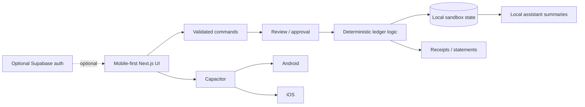

# Fluxo

## 30-second overview

**Fluxo is a mobile-first fintech product sandbox that demonstrates how banking-style workflows can be built with deterministic financial controls.** It includes Pix-style transfers, cards, budgets, goals, statements, request flows, and native Android/iOS builds.

**What I built:** the product UI, exact integer money handling, validation and review flows, duplicate-payment protection, ledger/state logic, receipts and statements, local persistence, optional Supabase authentication foundations, Capacitor mobile packaging, tests, CI, and Vercel deployment.

**Why it matters:** many fintech demos stop at screens. Fluxo focuses on the state, validation, idempotency, and approval behavior needed behind those screens while remaining clearly separated from real banking infrastructure.


> **Mobile-first fintech engineering sandbox for Pix-style transfers, cards, budgets, goals, Open Finance concepts, and deterministic financial state.**

Fluxo is a product-engineering portfolio project that combines a polished mobile interface with explicit review/approval flows, exact integer money handling, duplicate protection, local persistence, exportable statements, and Android/iOS Capacitor builds.

**Live deployment:** https://fluxo-fintech-xi.vercel.app/  
**Release:** v1.0.0

## At a glance

- TypeScript / Next.js application
- Mobile-first 430px product interface
- Pix-style transfer and request flows
- Virtual card lifecycle and configurable limits
- Deterministic balance and ledger checks
- Duplicate-command and duplicate-payment protection
- Budgets, goals, statements and transaction detail
- Android and iOS Capacitor projects
- GitHub Actions native test builds
- Optional Supabase authentication foundation
- Production deployment on Vercel

**Boundary:** Fluxo is a sandbox, not a regulated bank. It does not perform real Pix settlement, issue real cards, connect to production Open Finance providers, or move customer funds.

## Architecture



Critical financial state transitions are deterministic and validated outside the assistant layer. The AI-facing functionality summarizes sandbox state; it does not control real funds or provider credentials.

## Run locally

```sh
npm ci
npm run dev -- --port 3010
```

Open http://localhost:3010. No credentials are required for the sandbox.

## Sandbox features

- Add demo cards, create virtual cards, select, freeze/unfreeze, rename, change limits, remove cards, and export statements.
- Pix and transfers have explicit review/approval, integer money amounts, balance validation, duplicate protection, saved recipients, and downloadable/shareable receipts.
- Generate scannable Fluxo demo request QR codes, copy/import request codes, and retain request history. These are sandbox requests, not bank Pix QR codes.
- Account onboarding, profile settings, balance privacy, editable budgets, editable goals with tracked savings, bill payments, demo bank connections, and local assistant summaries.
- Record receipt expenses with merchant, amount, date and category. They appear in Activity and budget totals without changing the wallet balance. Confirmed deletion removes mistaken records. Receipt contents remain on the device and OCR is not performed.
- Restore a validated JSON account backup after reviewing and confirming replacement of the local account.
- Card Activity's View all opens a statement with CSV export.
- Home shortcuts include Exchange and Open Finance. Activity rows open transaction details.
- Data survives reloads and navigation in device/browser storage. Account settings provide export and a confirmed reset. Browser data and installed app data are separate.
- Native receipt sharing uses the operating system share sheet. Android Back closes dialogs or returns to the previous page.

Initial balances, purchases, budgets, and conversion rates are illustrative. Exchange is a quote preview; receipt details are entered manually without extracting file contents. Goal savings track progress without transferring money. The assistant computes local sandbox summaries. No real payments, issued cards, bank connections, or external AI requests occur.

## Verify

```sh
npm run typecheck
npm test
npm run build
npm run sync:native
```

Tests cover ledger integrity, exact currency parsing, balance checks, duplicate commands and duplicate bill payments. sync:native builds a static export into out/ and copies it into both native projects with installed plugins.

See [the sandbox audit](docs/SANDBOX_AUDIT.md) for verified flows, regression checks and remaining integration/device limits.

## Android and iOS

```sh
npm run sync:native
npm run open:android
# On macOS:
npm run open:ios
```

Local Android builds require Android Studio, JDK 21 and Android SDK 36. Local iOS builds require macOS and Xcode 26 or newer. Projects use the provisional identifier app.fluxo.mobile; choose your own identifier and signing configuration before distribution. Icons and an iOS filesystem privacy manifest are included. GitHub hosted runners have successfully compiled the Android debug APK and unsigned iOS simulator app.

See the [Capacitor development workflow](https://capacitorjs.com/docs/basics/workflow) for device builds and signing. Sync native files after UI changes. The native build contains local assets and does not point at localhost.

The manual **Native test builds** GitHub Actions workflow builds an Android debug APK and an unsigned iOS simulator app. Successful runs publish downloadable artifacts for 14 days. The simulator app is for Xcode's simulator; installing on a physical iPhone still requires Apple signing. These test packages are not store releases.

[Download the first successful native test build artifacts](https://github.com/murrayglenn75-beep/fluxo/actions/runs/37259188510).

## Optional live foundation

The original ledger, sandbox provider boundary, and Supabase migration are preserved. The Vercel deployment is configured with the public Supabase project URL and publishable key for the optional authentication foundation. This does not turn the client-side sandbox into a production banking backend. Keep service-role keys and provider credentials on a trusted server-side boundary.

Live payments/card issuance, bank consent, server persistence, receipt extraction and external AI need service accounts and backend implementation. The local demo account is independent of optional sign-in. Those integrations are deferred until accounts are available.

## Source rights

Copyright (c) 2026 Glenn Murray. All rights reserved.

This repository is public for portfolio and evaluation purposes. No permission is granted to copy, modify, redistribute, sublicense, commercialize, or create derivative works from the original source or architecture. See [NOTICE.md](NOTICE.md).